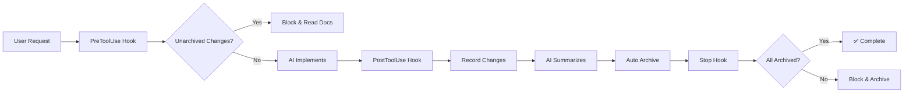
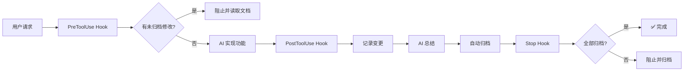

# 🚀 Code Documents Auto Skill

[](https://github.com/trainMini/code-documents-auto-skill)
[](LICENSE)
[](https://claude.ai/code)
[]()

[English](#-english) | [中文](#-中文)

---

## 🎯 What is this?

> **Automatically manage code documentation with Claude Code hooks!**
>
> No manual commands. No manual reading. No manual archiving.
> Just tell AI what to do, and everything happens automatically.

```
┌─────────────────────────────────────────────────────────────┐
│                    🔄 Auto Workflow                         │
├─────────────────────────────────────────────────────────────┤
│  User: "Add login feature"                                  │
│      ↓                                                      │
│  📖 AI reads docs automatically                             │
│      ↓                                                      │
│  💻 AI implements feature                                   │
│      ↓                                                      │
│  📝 AI summarizes & archives                                │
│      ↓                                                      │
│  ✅ Done! Documentation updated                             │
└─────────────────────────────────────────────────────────────┘
```

---

## 🇺🇸 English

### ✨ Features

| Feature | Description |
|---------|-------------|
| 📖 **Auto Read** | AI reads all related docs before coding |
| 📝 **Auto Record** | Automatically tracks all file changes |
| 🗄️ **Auto Archive** | AI summarizes and generates changelog |
| 🔄 **Auto Update** | Module docs updated automatically |
| 🚫 **No Manual Work** | Everything is fully automated |

### 📦 Installation

#### Method 1: Via Marketplace ⭐ Recommended

```bash
# Step 1: Add marketplace
/plugin marketplace add trainMini/code-documents-auto-skill

# Step 2: Install plugin
/plugin install code-documents-auto@code-documents-auto-skill
```

#### Method 2: Manual Installation

<details>
<summary>Click to expand 👆</summary>

```bash
# 1. Clone repository
git clone https://github.com/trainMini/code-documents-auto-skill.git ~/.claude/skills/code-documents-auto-skill

# 2. Add hooks to ~/.claude/settings.json
{
  "hooks": {
    "PreToolUse": [
      {
        "matcher": "Edit|Write|Bash",
        "hooks": [
          {
            "type": "command",
            "command": "bash ~/.claude/skills/code-documents-auto-skill/hooks/pre-edit-check.sh"
          }
        ]
      }
    ],
    "PostToolUse": [
      {
        "matcher": "Edit|Write|Bash",
        "hooks": [
          {
            "type": "command",
            "command": "bash ~/.claude/skills/code-documents-auto-skill/hooks/post-edit-archive.sh"
          }
        ]
      }
    ],
    "Stop": [
      {
        "hooks": [
          {
            "type": "command",
            "command": "bash ~/.claude/skills/code-documents-auto-skill/hooks/stop-check.sh"
          }
        ]
      }
    ]
  }
}
```

</details>

### ⚙️ How It Works



### 📁 File Structure

```
your-project/
├── 📂 .ai-context/
│   ├── 📄 .workflow-log.json     # 🔄 Workflow state
│   ├── 📄 README.md              # 📋 Project overview
│   ├── 📄 architecture.md        # 🏗️ System architecture
│   ├── 📂 guidelines/            # 📏 Coding standards
│   ├── 📂 modules/               # 📦 Module docs
│   ├── 📂 features/              # ✨ Feature docs
│   ├── 📂 api/                   # 🔌 API docs
│   ├── 📂 changelog/             # 📝 Change history
│   └── 📂 decisions/             # 🤔 Decision records
├── 📄 CLAUDE.md                   # 🤖 AI rules
└── 📄 AGENTS.md                   # 🎯 Agent rules
```

### 🛠️ Commands

| Command | Description |
|---------|-------------|
| `bash ~/.claude/skills/code-documents-auto-skill/scripts/scan-codebase.sh` | 🔍 Scan codebase |
| `bash ~/.claude/skills/code-documents-auto-skill/hooks/force-archive.sh "summary"` | 🗄️ Force archive |

---

## 🇨🇳 中文

### ✨ 功能特性

| 功能 | 描述 |
|------|------|
| 📖 **自动读取** | 编码前 AI 自动读取所有相关文档 |
| 📝 **自动记录** | 自动追踪所有文件变更 |
| 🗄️ **自动归档** | AI 总结并生成变更日志 |
| 🔄 **自动更新** | 模块文档自动更新 |
| 🚫 **无需手动** | 一切全自动完成 |

### 📦 安装步骤

#### 方式一：通过市场安装 ⭐ 推荐

```bash
# 第一步：添加市场
/plugin marketplace add trainMini/code-documents-auto-skill

# 第二步：安装插件
/plugin install code-documents-auto@code-documents-auto-skill
```

#### 方式二：手动安装

<details>
<summary>点击展开 👆</summary>

```bash
# 1. 克隆仓库
git clone https://github.com/trainMini/code-documents-auto-skill.git ~/.claude/skills/code-documents-auto-skill

# 2. 在 ~/.claude/settings.json 中添加 hooks
{
  "hooks": {
    "PreToolUse": [
      {
        "matcher": "Edit|Write|Bash",
        "hooks": [
          {
            "type": "command",
            "command": "bash ~/.claude/skills/code-documents-auto-skill/hooks/pre-edit-check.sh"
          }
        ]
      }
    ],
    "PostToolUse": [
      {
        "matcher": "Edit|Write|Bash",
        "hooks": [
          {
            "type": "command",
            "command": "bash ~/.claude/skills/code-documents-auto-skill/hooks/post-edit-archive.sh"
          }
        ]
      }
    ],
    "Stop": [
      {
        "hooks": [
          {
            "type": "command",
            "command": "bash ~/.claude/skills/code-documents-auto-skill/hooks/stop-check.sh"
          }
        ]
      }
    ]
  }
}
```

</details>

### ⚙️ 工作原理



### 📁 文件结构

```
your-project/
├── 📂 .ai-context/
│   ├── 📄 .workflow-log.json     # 🔄 工作流状态
│   ├── 📄 README.md              # 📋 项目概览
│   ├── 📄 architecture.md        # 🏗️ 系统架构
│   ├── 📂 guidelines/            # 📏 编码规范
│   ├── 📂 modules/               # 📦 模块文档
│   ├── 📂 features/              # ✨ 功能文档
│   ├── 📂 api/                   # 🔌 API 文档
│   ├── 📂 changelog/             # 📝 变更历史
│   └── 📂 decisions/             # 🤔 决策记录
├── 📄 CLAUDE.md                   # 🤖 AI 规则
└── 📄 AGENTS.md                   # 🎯 Agent 规则
```

### 🛠️ 命令

| 命令 | 描述 |
|------|------|
| `bash ~/.claude/skills/code-documents-auto-skill/scripts/scan-codebase.sh` | 🔍 扫描代码库 |
| `bash ~/.claude/skills/code-documents-auto-skill/hooks/force-archive.sh "summary"` | 🗄️ 强制归档 |

---

## 📊 Stats


---

## 🤝 Contributing

Contributions are welcome! Please feel free to submit a Pull Request.

1. Fork the repository
2. Create your feature branch (`git checkout -b feature/amazing-feature`)
3. Commit your changes (`git commit -m 'Add amazing feature'`)
4. Push to the branch (`git push origin feature/amazing-feature`)
5. Open a Pull Request

---

## 📄 License

This project is licensed under the MIT License - see the [LICENSE](LICENSE) file for details.

---

<div align="center">

**Made with ❤️ by [trainMini](https://github.com/trainMini)**

[](https://github.com/trainMini)
[](https://twitter.com/trainMini)

</div>
