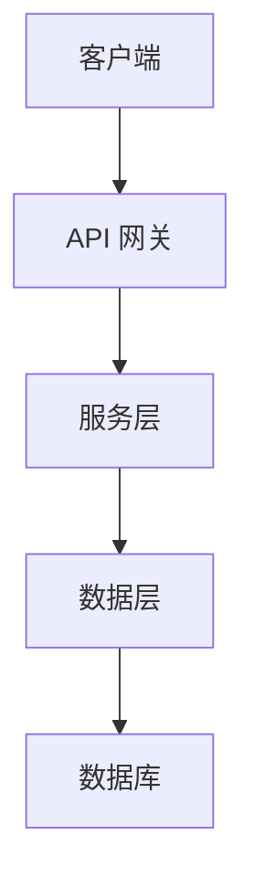
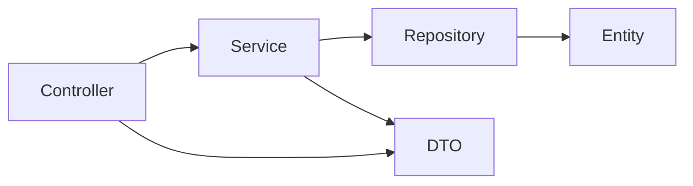

# Code Documents Auto Skill

完全由 AI 驱动的代码文档管理系统。

## 指令概览

| 指令 | 说明 | 使用场景 |
|------|------|----------|
| `/docs-scan` | 全量扫描，生成完整文档 | 首次使用、重大重构后 |
| `/docs-scan --update` | 增量更新，只更新变更部分 | 日常开发后 |
| `/code-documents-auto <任务>` | 读取模式，输出开发方案 | 开始新任务前 |
| `/code-documents-auto 归档` | 归档模式，更新文档 | 开发完成后 |

---

## 指令 1：/docs-scan（全量扫描）

**当用户输入 `/docs-scan` 时，你必须执行以下完整流程：**

### 前置检查

检查 `.ai-context/` 是否已存在：
- 如果已存在，询问用户：
  - 选择 `全量重新生成` - 覆盖所有文档
  - 选择 `增量更新` - 只更新变更部分（建议）
  - 选择 `取消` - 不执行任何操作
- 如果不存在，执行全量扫描

### 第一步：扫描项目结构

使用 Bash 工具执行以下命令，了解项目整体结构：

```bash
# 查看根目录
ls -la

# 查看目录树（排除无关目录）
find . -maxdepth 3 -type d \
  -not -path '*/node_modules/*' \
  -not -path '*/.git/*' \
  -not -path '*/__pycache__/*' \
  -not -path '*/vendor/*' \
  -not -path '*/dist/*' \
  -not -path '*/build/*' \
  -not -path '*/target/*' \
  -not -path '*/.ai-context/*' | sort
```

### 第二步：识别项目类型

检查以下文件来判断项目类型：

| 文件 | 项目类型 |
|------|----------|
| package.json | Node.js/TypeScript |
| requirements.txt / pyproject.toml / setup.py | Python |
| pom.xml / build.gradle | Java |
| go.mod | Go |
| Cargo.toml | Rust |

### 第三步：读取关键文件

根据项目类型，读取以下文件：

**所有项目：**
- 读取 README.md（如果存在）
- 读取配置文件（package.json, pom.xml 等）

**Node.js 项目：**
- 读取 package.json（获取依赖、脚本、项目描述）
- 读取 tsconfig.json（如果存在）
- 读取入口文件（src/index.ts, src/main.ts 等）

**Java 项目：**
- 读取 pom.xml 或 build.gradle（获取依赖）
- 读取 application.yml 或 application.properties（获取配置）
- 读取主启动类

**Python 项目：**
- 读取 requirements.txt 或 pyproject.toml
- 读取 main.py 或 app.py

### 第四步：分析代码模块

使用 Glob 工具查找代码文件：

```
# Node.js/TypeScript
**/*.ts, **/*.tsx, **/*.js, **/*.jsx

# Java
**/*.java

# Python
**/*.py
```

对每个模块目录，读取其核心文件，理解：
- 这个模块做什么
- 有哪些核心类/函数
- 对外暴露什么接口
- 依赖什么其他模块

### 第五步：分析数据库模块

**识别数据库类型和配置：**

| 文件/依赖 | 数据库类型 |
|-----------|-----------|
| mysql-connector, pg, mysql2 | 关系型数据库 |
| mongoose, prisma, typeorm, sequelize | ORM/ODM |
| redis, ioredis | 缓存数据库 |
| mongodb, MongoClient | 文档数据库 |
| application.yml 中的 datasource.* | Spring 数据源配置 |

**分析内容：**

1. **数据模型/实体**
   - 查找 Entity、Model、Schema 定义文件
   - 读取每个实体的字段定义和类型
   - 识别实体间关系（一对一、一对多、多对多）

2. **数据库配置**
   - 读取数据库连接配置
   - 识别连接池设置
   - 查找迁移/种子文件

3. **数据访问层**
   - 查找 Repository、DAO、Mapper 文件
   - 分析 CRUD 操作实现
   - 识别复杂查询和索引

4. **生成数据库文档**

创建 `.ai-context/database/README.md`：

```markdown
# 数据库设计

## 数据库类型

{数据库类型及版本}

## 连接配置

- 主机: {host}
- 端口: {port}
- 数据库名: {database}
- 连接池: {pool size}

## 数据模型

### {实体1} ({表名})

| 字段 | 类型 | 说明 |
|------|------|------|
| id | {类型} | 主键 |
| ... | ... | ... |

**关系:**
- 与 {实体2} 是 {关系类型}

### {实体2} ({表名})
...

## 索引设计

| 表 | 索引 | 字段 | 用途 |
|----|------|------|------|
| ... | ... | ... | ... |

## 数据访问

| Repository/DAO | 方法 | 说明 |
|----------------|------|------|
| {Repo1} | findAll() | 查询所有 |
| {Repo1} | findById(id) | 按 ID 查询 |
```

### 第六步：分析中间件使用

**识别中间件类型：**

| 文件/依赖 | 中间件类型 |
|-----------|-----------|
| express, koa, fastify | Web 框架中间件 |
| cors, helmet, compression | HTTP 中间件 |
| jsonwebtoken, passport | 认证中间件 |
| winston, pino, morgan | 日志中间件 |
| bull, agenda, bullmq | 任务队列 |
| socket.io, ws | WebSocket |
| axios, node-fetch | HTTP 客户端 |
| dotenv, config | 配置管理 |

**Java 项目中间件：**

| 依赖/配置 | 中间件类型 |
|-----------|-----------|
| spring-boot-starter-data-redis | Redis |
| spring-boot-starter-amqp | RabbitMQ |
| spring-kafka | Kafka |
| spring-boot-starter-mail | 邮件服务 |
| spring-boot-starter-websocket | WebSocket |
| @Scheduled, @EnableScheduling | 定时任务 |

**分析内容：**

1. **中间件配置**
   - 读取中间件配置文件
   - 识别初始化参数
   - 查找环境变量配置

2. **中间件使用方式**
   - 查找中间件注册/挂载代码
   - 分析中间件执行顺序
   - 识别自定义中间件

3. **生成中间件文档**

创建 `.ai-context/middleware/README.md`：

```markdown
# 中间件使用

## 中间件列表

| 中间件 | 版本 | 用途 |
|--------|------|------|
| {中间件1} | {版本} | {用途} |
| {中间件2} | {版本} | {用途} |

## 中间件配置

### {中间件1}

**配置文件**: {配置文件路径}

```json
{
  "key": "value"
}
```

**环境变量**:
- `{ENV_VAR}` - {说明}

### {中间件2}
...

## 中间件执行顺序

```
请求 → {中间件1} → {中间件2} → {中间件3} → 路由处理
```

## 自定义中间件

| 中间件 | 文件路径 | 功能 |
|--------|----------|------|
| {中间件名} | {路径} | {功能说明} |

## 使用示例

```javascript
// {中间件1} 使用示例
{代码示例}
```
```

### 第七步：分析 API 路由

读取路由/控制器文件，识别所有 API 端点：
- HTTP 方法（GET, POST, PUT, DELETE）
- 路径（/api/users, /chat 等）
- 请求参数和响应格式

### 第八步：生成文档

使用 Write 工具创建以下文档：

#### 8.1 创建 .ai-context/README.md

**文档目的：** 让 AI 快速了解项目全貌，包括技术栈、模块划分、开发规范

```markdown
# {项目名称}

## 项目概览

{基于 package.json/pom.xml 中的 description，以及你对代码的理解}

**项目类型**: {前端/后端/全栈/微服务/CLI 工具/库}
**主要用途**: {这个项目解决什么问题}
**目标用户**: {谁在使用这个项目}

## 技术栈

### 核心框架

| 技术 | 版本 | 用途 | 官方文档 |
|------|------|------|----------|
| {语言} | {版本} | 编程语言 | {URL} |
| {框架} | {版本} | 应用框架 | {URL} |

### 数据库

| 数据库 | 版本 | 用途 | ORM/驱动 |
|--------|------|------|----------|
| {数据库1} | {版本} | {用途} | {ORM} |

### 中间件

| 中间件 | 版本 | 用途 |
|--------|------|------|
| {中间件1} | {版本} | {用途} |

### 开发工具

| 工具 | 版本 | 用途 |
|------|------|------|
| {工具1} | {版本} | {用途} |

## 核心模块

### 业务模块

- **{模块1}** - {详细说明，包含主要功能}
- **{模块2}** - {详细说明，包含主要功能}

### 基础设施模块

- **{模块3}** - {详细说明，包含主要功能}
- **{模块4}** - {详细说明，包含主要功能}

## 项目结构

```
{项目名}/
├── src/                    # 源代码目录
│   ├── {目录1}/           # {说明}
│   ├── {目录2}/           # {说明}
│   └── ...
├── test/                   # 测试目录
├── config/                 # 配置目录
├── docs/                   # 文档目录
└── ...
```

## 文档导航

| 文档 | 说明 | 何时使用 |
|------|------|----------|
| [architecture.md](./architecture.md) | 系统架构设计 | 理解整体架构、模块关系 |
| [modules/](./modules/) | 模块详细文档 | 修改特定模块时 |
| [api/](./api/) | API 接口文档 | 调用或修改 API 时 |
| [database/](./database/) | 数据库设计 | 修改数据模型、查询时 |
| [middleware/](./middleware/) | 中间件使用 | 修改中间件配置时 |
| [guidelines/](./guidelines/) | 编码规范 | 编写代码时遵循 |
| [changelog/](./changelog/) | 变更记录 | 了解历史变更 |
| [decisions/](./decisions/) | 技术决策 | 理解设计决策原因 |

## 快速开始

### 环境要求

- {语言} {版本以上}
- {数据库} {版本以上}
- {其他依赖}

### 安装步骤

```bash
# 1. 克隆项目
git clone {仓库地址}

# 2. 安装依赖
{安装命令}

# 3. 配置环境变量
{配置说明}

# 4. 初始化数据库（如需要）
{数据库初始化命令}

# 5. 启动应用
{启动命令}
```

### 常用命令

```bash
# 开发模式
{开发命令}

# 构建
{构建命令}

# 测试
{测试命令}

# 代码检查
{lint 命令}
```

## 开发规范摘要

- **代码风格**: {简要说明}
- **提交规范**: {简要说明}
- **分支策略**: {简要说明}

详见 [guidelines/coding-style.md](./guidelines/coding-style.md)

## 注意事项

- {重要注意事项 1}
- {重要注意事项 2}
- {重要注意事项 3}
```

#### 8.2 创建 .ai-context/architecture.md

**文档目的：** 让 AI 理解系统整体架构、模块关系、数据流向，便于进行架构级别的修改

```markdown
# 系统架构

## 整体架构

### 架构图

{用 Mermaid 或 ASCII 图描述系统架构}



### 架构说明

- **架构模式**: {单体/微服务/Serverless/...}
- **设计原则**: {SOLID/DDD/...}
- **通信方式**: {REST/gRPC/消息队列/...}

## 分层说明

### Controller 层 (表现层)

**职责**: 处理 HTTP 请求，参数校验，调用 Service 层

| Controller | 文件路径 | 路径前缀 | 主要职责 |
|-----------|----------|----------|----------|
| {Controller1} | {路径} | {前缀} | {职责} |
| {Controller2} | {路径} | {前缀} | {职责} |

**处理流程**:
1. 接收 HTTP 请求
2. 参数校验（使用 {校验框架}）
3. 调用 Service 层
4. 返回响应（统一格式 {响应格式}）

### Service 层 (业务层)

**职责**: 实现业务逻辑，事务管理，调用 Repository 层

| Service | 文件路径 | 主要职责 | 依赖的 Repository |
|---------|----------|----------|-------------------|
| {Service1} | {路径} | {职责} | {Repository} |
| {Service2} | {路径} | {职责} | {Repository} |

**事务管理**:
- 事务边界: {在哪个层管理事务}
- 事务传播: {REQUIRED/REQUIRES_NEW/...}
- 回滚规则: {什么情况下回滚}

### Repository 层 (数据访问层)

**职责**: 数据库操作，数据持久化

| Repository | 文件路径 | 对应实体 | 主要方法 |
|-----------|----------|----------|----------|
| {Repository1} | {路径} | {Entity} | {方法列表} |
| {Repository2} | {路径} | {Entity} | {方法列表} |

### Model 层 (模型层)

**职责**: 定义数据模型，实体关系

| Entity | 文件路径 | 对应表 | 主要字段 |
|--------|----------|--------|----------|
| {Entity1} | {路径} | {表名} | {字段列表} |
| {Entity2} | {路径} | {表名} | {字段列表} |

## 模块依赖关系



### 依赖说明

- {Controller1} 依赖 {Service1}, {Service2}
- {Service1} 依赖 {Repository1}, {Repository2}
- {Repository1} 依赖 {Entity1}

## 数据流

### 请求处理流程

```
客户端请求
    ↓
[中间件层] - 认证、日志、CORS 等
    ↓
[Controller 层] - 路由匹配、参数校验
    ↓
[Service 层] - 业务逻辑处理
    ↓
[Repository 层] - 数据库操作
    ↓
[数据库] - 数据持久化
    ↓
响应返回客户端
```

### 主要业务流程

#### {业务流程1}

```
1. 用户发起 {请求类型} 请求到 {接口路径}
2. Controller 接收请求，调用 {Service}.{方法}
3. Service 执行业务逻辑：
   - {步骤1}
   - {步骤2}
   - {步骤3}
4. Repository 执行数据库操作
5. 返回结果给客户端
```

#### {业务流程2}
...

## 异常处理

### 异常分类

| 异常类型 | 处理方式 | HTTP 状态码 | 说明 |
|----------|----------|------------|------|
| {业务异常} | {处理方式} | {状态码} | {说明} |
| {参数异常} | {处理方式} | {状态码} | {说明} |
| {系统异常} | {处理方式} | {状态码} | {说明} |

### 异常处理流程

```
异常抛出
    ↓
[全局异常处理器] - {处理器类名}
    ↓
[异常分类处理]
    ↓
[统一响应格式] - {响应格式}
    ↓
返回错误响应
```

### 自定义异常

| 异常类 | 文件路径 | 用途 | 错误码 |
|--------|----------|------|--------|
| {异常1} | {路径} | {用途} | {错误码} |
| {异常2} | {路径} | {用途} | {错误码} |

## 安全机制

### 认证方式

- **类型**: {JWT/Session/OAuth2/...}
- **实现**: {使用的库/框架}
- **流程**: {认证流程说明}

### 授权机制

- **类型**: {RBAC/ABAC/...}
- **实现**: {实现方式}
- **权限粒度**: {接口级/方法级/数据级}

### 数据安全

- **敏感数据**: {哪些字段加密}
- **加密方式**: {加密算法}
- **传输安全**: {HTTPS/TLS}

## 性能优化

### 缓存策略

- **缓存类型**: {Redis/内存/CDN}
- **缓存粒度**: {页面/接口/数据}
- **缓存策略**: {TTL/LRU/...}

### 数据库优化

- **索引策略**: {索引设计原则}
- **查询优化**: {查询优化技巧}
- **连接池**: {连接池配置}

## 扩展点

### 可扩展设计

- {扩展点1}: {如何扩展}
- {扩展点2}: {如何扩展}

### 插件机制

- {插件类型}: {如何开发插件}

## 部署架构

### 部署方式

- {部署方式}: {Docker/K8s/VM/...}
- {环境}: {开发/测试/生产}

### 环境配置

| 环境 | 配置文件 | 主要差异 |
|------|----------|----------|
| 开发 | {配置文件} | {差异} |
| 测试 | {配置文件} | {差异} |
| 生产 | {配置文件} | {差异} |
```

#### 8.3 创建 .ai-context/modules/ 目录

**文档目的：** 让 AI 快速理解每个模块的职责、核心类、接口，便于修改特定模块

为每个模块创建文档：

```markdown
# {模块名} 模块

## 模块概述

{基于你对代码的理解，详细描述这个模块做什么}

**模块职责**: {主要职责}
**所在位置**: {模块目录路径}
**依赖模块**: {依赖的其他模块}
**被依赖模块**: {依赖此模块的其他模块}

## 核心类

### {类名1}

**文件路径**: `{文件路径}`
**类类型**: {Controller/Service/Repository/Entity/DTO/工具类}
**职责**: {详细职责说明}

#### 类结构

```{语言}
// 类的关键结构（字段、方法签名）
public class {类名} {
    // 字段
    private {类型} {字段名}; // {说明}

    // 构造函数
    public {类名}({参数}) { ... }

    // 公开方法
    public {返回类型} {方法名}({参数}) { ... }
}
```

#### 方法详解

| 方法 | 参数 | 返回值 | 说明 | 异常 |
|------|------|--------|------|------|
| {方法1} | {参数列表} | {返回类型} | {详细说明} | {可能抛出的异常} |
| {方法2} | {参数列表} | {返回类型} | {详细说明} | {可能抛出的异常} |

#### 使用示例

```{语言}
// 如何调用这个类的示例代码
{示例代码}
```

#### 注意事项

- {注意事项1}
- {注意事项2}

### {类名2}

**文件路径**: `{文件路径}`
**类类型**: {类型}
**职责**: {职责说明}

{同上格式}

## 数据模型

### {Entity 名}

**文件路径**: `{文件路径}`
**对应表**: {表名}
**用途**: {用途说明}

| 字段 | 类型 | 必填 | 默认值 | 说明 | 索引 |
|------|------|------|--------|------|------|
| id | {类型} | 是 | 自增 | 主键 | PRIMARY |
| {字段1} | {类型} | {是/否} | {默认值} | {说明} | {索引} |
| created_at | {类型} | 是 | 当前时间 | 创建时间 | - |
| updated_at | {类型} | 是 | 当前时间 | 更新时间 | - |

**关系**:
- 与 {Entity2} 是 {关系类型}（外键: {字段}）

### {DTO 名}

**文件路径**: `{文件路径}`
**用途**: {Request/Response/通用}

| 字段 | 类型 | 必填 | 校验规则 | 说明 |
|------|------|------|----------|------|
| {字段1} | {类型} | {是/否} | {校验规则} | {说明} |
| {字段2} | {类型} | {是/否} | {校验规则} | {说明} |

## 接口列表

### {接口分组1}

| 方法 | 路径 | 说明 | 认证 | 权限 |
|------|------|------|------|------|
| GET | /api/xxx/{id} | {说明} | {是/否} | {权限} |
| POST | /api/xxx | {说明} | {是/否} | {权限} |
| PUT | /api/xxx/{id} | {说明} | {是/否} | {权限} |
| DELETE | /api/xxx/{id} | {说明} | {是/否} | {权限} |

### 接口详情

#### {接口1}

**请求**:
```http
{HTTP方法} {路径}
Content-Type: {内容类型}
Authorization: {认证方式}

{请求体示例}
```

**响应**:
```json
{
  "code": 200,
  "message": "success",
  "data": {
    // 响应数据结构
  }
}
```

**错误响应**:
```json
{
  "code": {错误码},
  "message": "{错误信息}",
  "data": null
}
```

#### {接口2}

{同上格式}

## 业务流程

### {流程1}

```
1. {步骤1}
2. {步骤2}
3. {步骤3}
```

**流程说明**: {详细说明}

### {流程2}

{同上格式}

## 配置项

| 配置项 | 文件 | 默认值 | 说明 |
|--------|------|--------|------|
| {配置1} | {文件} | {默认值} | {说明} |
| {配置2} | {文件} | {默认值} | {说明} |

## 依赖关系图

```mermaid
graph LR
    A[{类1}] --> B[{类2}]
    B --> C[{类3}]
    A --> D[{类4}]
```

## 测试

### 测试文件

| 测试类 | 文件路径 | 测试内容 |
|--------|----------|----------|
| {测试1} | {路径} | {内容} |

### 测试覆盖

- {方法1}: {覆盖情况}
- {方法2}: {覆盖情况}

## 常见修改场景

### 场景1：{修改场景}

**涉及文件**:
- {文件1}
- {文件2}

**修改步骤**:
1. {步骤1}
2. {步骤2}

**注意事项**:
- {注意事项}

### 场景2：{修改场景}

{同上格式}

## 已知问题

- {问题1}: {描述和解决方案}
- {问题2}: {描述和解决方案}
```

#### 8.4 创建 .ai-context/api/ 目录

**文档目的：** 让 AI 快速理解每个 API 的请求/响应格式、业务逻辑、错误处理

为每个 API 模块创建文档：

```markdown
# {API名} API

## 概述

{描述这个 API 做什么}

**API 版本**: {版本}
**基础路径**: {基础路径}
**认证方式**: {认证方式}
**速率限制**: {速率限制}

## 接口列表

| 方法 | 路径 | 说明 | 认证 | 权限 |
|------|------|------|------|------|
| GET | /api/xxx | {说明} | {是/否} | {权限} |
| POST | /api/xxx | {说明} | {是/否} | {权限} |

## 接口详情

### {接口1}

#### 基本信息

- **接口路径**: `{METHOD} {路径}`
- **接口说明**: {详细说明}
- **认证要求**: {认证要求}
- **权限要求**: {权限要求}

#### 请求参数

**路径参数**:

| 参数 | 类型 | 必填 | 说明 | 示例 |
|------|------|------|------|------|
| {参数1} | {类型} | {是/否} | {说明} | {示例} |

**查询参数**:

| 参数 | 类型 | 必填 | 默认值 | 说明 | 示例 |
|------|------|------|--------|------|------|
| {参数1} | {类型} | {是/否} | {默认值} | {说明} | {示例} |

**请求头**:

| Header | 必填 | 说明 |
|--------|------|------|
| Content-Type | 是 | application/json |
| Authorization | {是/否} | {认证方式} |

**请求体**:

```json
{
  "{字段1}": "{类型和说明}",
  "{字段2}": "{类型和说明}"
}
```

**请求体字段说明**:

| 字段 | 类型 | 必填 | 校验规则 | 说明 |
|------|------|------|----------|------|
| {字段1} | {类型} | {是/否} | {校验规则} | {说明} |
| {字段2} | {类型} | {是/否} | {校验规则} | {说明} |

#### 响应

**成功响应 (200)**:

```json
{
  "code": 200,
  "message": "success",
  "data": {
    "{字段1}": "{说明}",
    "{字段2}": "{说明}"
  }
}
```

**成功响应字段说明**:

| 字段 | 类型 | 说明 |
|------|------|------|
| code | int | 状态码 |
| message | string | 提示信息 |
| data | object | 业务数据 |
| data.{字段1} | {类型} | {说明} |
| data.{字段2} | {类型} | {说明} |

**错误响应**:

| 状态码 | 错误码 | 说明 | 触发条件 |
|--------|--------|------|----------|
| 400 | {错误码} | {说明} | {触发条件} |
| 401 | {错误码} | {说明} | {触发条件} |
| 403 | {错误码} | {说明} | {触发条件} |
| 404 | {错误码} | {说明} | {触发条件} |
| 500 | {错误码} | {说明} | {触发条件} |

**错误响应示例**:

```json
{
  "code": 400,
  "message": "{错误信息}",
  "data": null
}
```

#### 调用示例

**cURL**:
```bash
curl -X {METHOD} \
  'http://localhost:8000{路径}' \
  -H 'Content-Type: application/json' \
  -H 'Authorization: Bearer {token}' \
  -d '{
    "{字段1}": "{值}",
    "{字段2}": "{值}"
  }'
```

**JavaScript (fetch)**:
```javascript
const response = await fetch('http://localhost:8000{路径}', {
  method: '{METHOD}',
  headers: {
    'Content-Type': 'application/json',
    'Authorization': `Bearer ${token}`
  },
  body: JSON.stringify({
    {字段1}: '{值}',
    {字段2}: '{值}'
  })
});
const data = await response.json();
```

**Python (requests)**:
```python
import requests

response = requests.{method}(
    'http://localhost:8000{路径}',
    json={
        '{字段1}': '{值}',
        '{字段2}': '{值}'
    },
    headers={'Authorization': f'Bearer {token}'}
)
data = response.json()
```

#### 业务逻辑

```
1. {步骤1}
2. {步骤2}
3. {步骤3}
```

**逻辑说明**: {详细说明}

#### 注意事项

- {注意事项1}
- {注意事项2}
- {注意事项3}

#### 关联接口

- {关联接口1}: {说明关联关系}
- {关联接口2}: {说明关联关系}

### {接口2}

{同上格式}

## 数据模型

### {Request DTO}

```json
{
  "{字段1}": "{类型}",
  "{字段2}": "{类型}"
}
```

### {Response DTO}

```json
{
  "{字段1}": "{类型}",
  "{字段2}": "{类型}"
}
```

## 错误码汇总

| 错误码 | 说明 | HTTP 状态码 | 处理建议 |
|--------|------|------------|----------|
| {错误码1} | {说明} | {状态码} | {处理建议} |
| {错误码2} | {说明} | {状态码} | {处理建议} |

## 测试用例

### {测试场景1}

**请求**:
```json
{
  "{字段}": "{测试值}"
}
```

**预期响应**:
```json
{
  "code": 200,
  "message": "success",
  "data": {
    // 预期数据
  }
}
```

### {测试场景2}

{同上格式}

## 变更记录

| 日期 | 版本 | 变更说明 |
|------|------|----------|
| {日期} | {版本} | {说明} |
```

#### 8.5 创建 .ai-context/guidelines/ 目录

**文档目的：** 让 AI 快速了解项目的编码规范，保持代码风格一致性

基于项目的代码风格，生成编码规范：

```markdown
# 编码规范

## 代码风格

### 基本规则

- **缩进**: {缩进方式，如 2 空格/4 空格/Tab}
- **引号**: {引号风格，如 单引号/双引号}
- **分号**: {是否使用分号}
- **行宽**: {最大行宽，如 80/100/120 字符}
- **换行**: {换行规则}

### 代码格式

```{语言}
// 示例代码，展示项目的代码风格
{示例代码}
```

### 注释规范

- **单行注释**: {风格}
- **多行注释**: {风格}
- **文档注释**: {风格，如 JSDoc/Javadoc/Python docstring}

```{语言}
// 单行注释示例

/**
 * 多行注释示例
 * @param {类型} {参数名} - {说明}
 * @returns {类型} {说明}
 */
```

## 命名规范

### 文件命名

| 文件类型 | 命名规则 | 示例 |
|----------|----------|------|
| {类型1} | {规则} | {示例} |
| {类型2} | {规则} | {示例} |

### 变量命名

| 变量类型 | 命名规则 | 示例 |
|----------|----------|------|
| 普通变量 | {规则} | {示例} |
| 常量 | {规则} | {示例} |
| 私有变量 | {规则} | {示例} |

### 函数命名

| 函数类型 | 命名规则 | 示例 |
|----------|----------|------|
| 普通函数 | {规则} | {示例} |
| getter/setter | {规则} | {示例} |
| 事件处理 | {规则} | {示例} |
| 异步函数 | {规则} | {示例} |

### 类命名

| 类类型 | 命名规则 | 示例 |
|--------|----------|------|
| {类型1} | {规则} | {示例} |
| {类型2} | {规则} | {示例} |

## 分层规范

### 目录结构

```
src/
├── {目录1}/        # {说明}
├── {目录2}/        # {说明}
├── {目录3}/        # {说明}
└── ...
```

### 模块组织

- {模块1}: {组织方式}
- {模块2}: {组织方式}

### 依赖规则

- {规则1}
- {规则2}
- {规则3}

## 错误处理规范

### 异常定义

- {异常类型1}: {使用场景}
- {异常类型2}: {使用场景}

### 错误响应格式

```json
{
  "code": {错误码},
  "message": "{错误信息}",
  "data": null
}
```

### 日志规范

- **日志级别**: {DEBUG/INFO/WARN/ERROR 使用场景}
- **日志格式**: {日志格式}
- **敏感信息**: {哪些信息不能记录}

## 测试规范

### 测试文件组织

- 测试文件位置: {位置}
- 测试文件命名: {命名规则}
- 测试覆盖率要求: {覆盖率要求}

### 测试命名规范

```{语言}
// 测试命名示例
describe('{模块名}', () => {
  it('应该 {预期行为} when {条件}', () => {
    // 测试代码
  });
});
```

## 提交规范

### Commit Message 格式

```
{类型}({范围}): {描述}

{详细说明}

{关联信息}
```

### 类型说明

| 类型 | 说明 |
|------|------|
| feat | 新功能 |
| fix | 修复 bug |
| docs | 文档更新 |
| style | 代码格式调整 |
| refactor | 重构 |
| test | 测试相关 |
| chore | 构建/工具相关 |

## Git 工作流

### 分支策略

- **main**: {说明}
- **develop**: {说明}
- **feature/***: {说明}
- **hotfix/***: {说明}

### 分支命名

- feature/{功能名}
- bugfix/{bug描述}
- hotfix/{问题描述}

## 代码审查清单

- [ ] 代码风格符合规范
- [ ] 命名清晰有意义
- [ ] 适当的注释
- [ ] 错误处理完善
- [ ] 测试覆盖充分
- [ ] 无安全漏洞
- [ ] 性能考虑
```

#### 8.6 创建 .ai-context/changelog/ 目录

**文档目的：** 记录每次代码变更的完整生命周期，结合实际开发流程，便于追溯、审计和知识沉淀

**Changelog 文件结构：**

```
.ai-context/changelog/
├── README.md                                    # 总索引（变更统计、最近变更列表）
├── 2026-06-01-143000-add-user-auth/            # 某次迭代的文件夹
│   ├── overview.md                              # 变更概述（背景、目的、类型）
│   ├── files.md                                 # 文件清单（代码、配置、文档）
│   ├── technical.md                             # 技术细节（核心变更、技术决策）
│   ├── impact.md                                # 影响范围（功能、性能、安全、兼容性）
│   ├── testing.md                               # 测试验证（单元测试、集成测试、手动测试）
│   └── deployment.md                            # 部署信息（部署要求、验证步骤、回滚方案）
├── 2026-06-01-153000-fix-login-bug/            # 另一次迭代
│   ├── overview.md
│   ├── files.md
│   ├── technical.md
│   ├── impact.md
│   ├── testing.md
│   └── deployment.md
└── dev-cycles/                                  # 开发周期记录（可选）
    └── 2026-06-user-auth-feature.md             # 完整开发周期
```

**创建 changelog/README.md：**

```markdown
# 变更记录

> 项目所有变更的总索引，按时间倒序排列

## 变更统计

| 指标 | 数量 |
|------|------|
| 总变更次数 | {数量} |
| 功能新增 | {数量} |
| Bug 修复 | {数量} |
| 重构 | {数量} |
| 配置变更 | {数量} |
| 文档更新 | {数量} |

## 变更历史

| 日期 | 标题 | 类型 | 模块 | 作者 | 状态 | 详情 |
|------|------|------|------|------|------|------|
| {日期} | {标题} | {类型} | {模块} | {作者} | {状态} | [查看](./{文件夹名}/) |

## 按模块统计

| 模块 | 变更次数 | 最近变更 |
|------|----------|----------|
| {模块1} | {次数} | {日期} |
| {模块2} | {次数} | {日期} |

## 按类型统计

| 类型 | 数量 | 占比 |
|------|------|------|
| feat | {数量} | {百分比} |
| fix | {数量} | {百分比} |
| refactor | {数量} | {百分比} |
| docs | {数量} | {百分比} |
| chore | {数量} | {百分比} |
```

**创建迭代文件夹：**

文件夹命名：`{YYYY-MM-DD-HHMMSS}-{变更标识}/`

每个迭代文件夹包含以下 6 个文档，以及可选的用户文档：

**用户文档处理：**

如果用户提供了需求文档、技术文档、测试报告等，需要：

1. **创建文档目录**：`.ai-context/changelog/{文件夹名}/docs/`
2. **按类型存放**：
   - `docs/requirements/` - 需求文档
   - `docs/technical/` - 技术文档
   - `docs/testing/` - 测试报告
   - `docs/design/` - 设计文档
   - `docs/other/` - 其他文档
3. **在对应文档中引用**：
   - overview.md 中引用需求文档
   - technical.md 中引用技术文档
   - testing.md 中引用测试报告

```
2026-06-01-143000-add-user-auth/
├── overview.md
├── files.md
├── technical.md
├── impact.md
├── testing.md
├── deployment.md
└── docs/                              # 用户提供的文档（可选）
    ├── requirements/                  # 需求文档
    │   └── user-auth-requirement.md
    ├── technical/                     # 技术文档
    │   └── auth-design.md
    ├── testing/                       # 测试报告
    │   └── auth-test-report.md
    └── design/                        # 设计文档
        └── auth-flow-diagram.md
```

每个迭代文件夹包含以下 6 个核心文档：

**1. overview.md - 变更概述**

```markdown
---
date: {YYYY-MM-DD HH:MM:SS}
type: {feat/fix/refactor/docs/chore/perf/test/ci}
scope: {影响范围}
author: "{作者名}"
status: {done/in-progress/reverted}
branch: "{分支名}"
commit: "{commit hash}"
---

# {变更标题}

> {一句话概述变更的目的和价值}

## 需求背景

### 业务需求

{描述业务需求或问题背景}

- **需求来源**: {Jira/用户反馈/技术债务/安全漏洞/性能优化}
- **需求编号**: {需求编号}
- **优先级**: {P0/P1/P2/P3}
- **影响用户**: {哪些用户受到影响}

### 需求文档

> 如果用户提供了需求文档，记录在这里

- **文档路径**: [docs/requirements/{文档名}.md](./docs/requirements/{文档名}.md)
- **文档摘要**: {需求文档的核心要点}

### 问题描述

{如果是 bug 修复，详细描述问题现象}

- **复现步骤**:
  1. {步骤1}
  2. {步骤2}
  3. {步骤3}
- **预期行为**: {预期行为}
- **实际行为**: {实际行为}

### 技术背景

{描述技术层面的背景信息}

- **现有实现**: {现有实现的问题}
- **技术债务**: {是否存在技术债务}

## 变更内容概述

{用几句话概括本次变更的主要内容}

- [x] {功能点1}
- [x] {功能点2}

## 关联信息

- **关联 Issue**: #{issue号}
- **关联 PR**: #{pr号}
- **关联变更**: {关联的其他变更}
```

**2. files.md - 文件清单**

```markdown
# 文件清单

> 本次变更涉及的所有文件

## 变更统计

| 指标 | 数量 |
|------|------|
| 修改文件 | {数量} |
| 新增文件 | {数量} |
| 删除文件 | {数量} |
| 变更行数 | +{新增}/-{删除} |

## 代码文件

| 文件路径 | 状态 | 模块 | 变更类型 | 说明 |
|----------|------|------|----------|------|
| src/xxx/xxx.java | 新增 | {模块} | {核心/辅助/测试} | {说明} |
| src/xxx/xxx.java | 修改 | {模块} | {核心/辅助/测试} | {说明} |
| src/xxx/xxx.java | 删除 | {模块} | {核心/辅助/测试} | {说明} |

## 配置文件

| 文件路径 | 状态 | 变更说明 |
|----------|------|----------|
| application.yml | 修改 | {说明} |
| pom.xml | 修改 | {说明} |

## 文档文件

| 文件路径 | 状态 | 变更说明 |
|----------|------|----------|
| .ai-context/modules/xxx.md | 更新 | {说明} |
| .ai-context/api/xxx.md | 更新 | {说明} |
```

**3. technical.md - 技术细节**

```markdown
# 技术细节

> 本次变更的核心技术实现

## 技术文档

> 如果用户提供了技术文档，记录在这里

- **文档路径**: [docs/technical/{文档名}.md](./docs/technical/{文档名}.md)
- **文档摘要**: {技术文档的核心要点}

## 架构变更

{描述架构层面的变更}

## 核心代码变更

### 变更点 1：{变更点标题}

**文件**: `{文件路径}`

**变更前**:
```java
// 原有代码（关键片段）
{代码片段}
```

**变更后**:
```java
// 新代码（关键片段）
{代码片段}
```

**变更原因**: {为什么这样改}

### 变更点 2：{变更点标题}

{同上格式}

## 接口变更

- {API 接口变更说明}

## 数据变更

- {数据库/数据结构变更说明}

## 配置变更

- {配置项变更说明}

## 技术决策

### 决策 1：{决策标题}

**背景**: {为什么需要做这个决策}

**备选方案**:

| 方案 | 优点 | 缺点 |
|------|------|------|
| 方案A | {优点} | {缺点} |
| 方案B | {优点} | {缺点} |

**最终选择**: {选择的方案}

**选择理由**: {为什么选择这个方案}

## 依赖变更

- {新增/升级/删除的依赖}
```

**4. impact.md - 影响范围**

```markdown
# 影响范围

> 本次变更对系统各方面的影响

## 功能影响

| 功能模块 | 影响程度 | 影响说明 |
|----------|----------|----------|
| {模块1} | 重大/轻微/无 | {说明} |
| {模块2} | 重大/轻微/无 | {说明} |

## 性能影响

- **响应时间**: {提升/降低/无变化} {数值}
- **内存占用**: {增加/减少/无变化} {数值}
- **CPU 使用**: {增加/减少/无变化} {数值}

## 安全影响

- **认证**: {是否有影响}
- **授权**: {是否有影响}
- **数据安全**: {是否有影响}

## 兼容性影响

- **API 兼容性**: {是否破坏性变更}
- **数据兼容性**: {是否需要数据迁移}
- **客户端兼容性**: {是否需要客户端更新}

## 下游影响

- {影响的其他模块或服务}

## 风险点

- ⚠️ {风险1}：{说明和规避方案}
- ⚠️ {风险2}：{说明和规避方案}
```

**5. testing.md - 测试验证**

```markdown
# 测试验证

> 本次变更的测试情况

## 测试报告

> 如果用户提供了测试报告，记录在这里

- **文档路径**: [docs/testing/{文档名}.md](./docs/testing/{文档名}.md)
- **文档摘要**: {测试报告的核心要点}

## 单元测试

| 测试类 | 测试方法 | 测试场景 | 结果 |
|--------|----------|----------|------|
| {测试类} | {方法} | {场景} | ✅/❌ |

## 集成测试

| 测试场景 | 测试步骤 | 预期结果 | 实际结果 | 状态 |
|----------|----------|----------|----------|------|
| {场景} | {步骤} | {预期} | {实际} | ✅/❌ |

## 手动测试

- [x] {测试点1}
- [x] {测试点2}
- [ ] {未测试的点}

## 测试覆盖

| 维度 | 覆盖情况 |
|------|----------|
| 代码覆盖率 | {百分比} |
| 接口覆盖率 | {百分比} |
| 场景覆盖率 | {百分比} |

## 测试结论

{测试是否通过，是否有遗留问题}
```

**6. deployment.md - 部署信息**

```markdown
# 部署信息

> 本次变更的部署要求和步骤

## 部署要求

- **环境要求**: {环境要求}
- **配置变更**: {需要修改的配置}
- **依赖变更**: {新增/升级的依赖}
- **数据库变更**: {是否需要执行迁移脚本}

## 部署步骤

1. {步骤1}
2. {步骤2}
3. {步骤3}

## 验证步骤

1. {验证步骤1}
2. {验证步骤2}
3. {验证步骤3}

## 回滚方案

### 回滚条件

- {什么情况下需要回滚}

### 回滚步骤

1. {回滚步骤1}
2. {回滚步骤2}
3. {回滚步骤3}

### 回滚影响

- {回滚会带来什么影响}

## 后续计划

### 待完成

- [ ] {待完成的任务1}
- [ ] {待完成的任务2}

### 优化方向

- {可以进一步优化的方向}

### 监控要点

- {上线后需要关注的指标}
```

## 技术决策

### 决策 1：{决策标题}

**背景**: {为什么需要做这个决策}

**备选方案**:

| 方案 | 优点 | 缺点 |
|------|------|------|
| 方案A | {优点} | {缺点} |
| 方案B | {优点} | {缺点} |

**最终选择**: {选择的方案}

**选择理由**: {为什么选择这个方案}

**权衡取舍**: {放弃了什么，得到了什么}

---

## 开发过程

### 开发步骤

1. **{步骤1}**: {说明}
2. **{步骤2}**: {说明}
3. **{步骤3}**: {说明}

### 遇到的问题

#### 问题 1：{问题标题}

**现象**: {问题现象}

**排查过程**:
1. {排查步骤1}
2. {排查步骤2}

**根本原因**: {根本原因}

**解决方案**: {解决方案}

**经验教训**: {从这个问题学到了什么}

---

## 测试验证

### 单元测试

| 测试类 | 测试方法 | 测试场景 | 结果 |
|--------|----------|----------|------|
| {测试类} | {方法} | {场景} | ✅/❌ |

### 集成测试

| 测试场景 | 测试步骤 | 预期结果 | 实际结果 | 状态 |
|----------|----------|----------|----------|------|
| {场景} | {步骤} | {预期} | {实际} | ✅/❌ |

### 手动测试

- [x] {测试点1}
- [x] {测试点2}
- [ ] {未测试的点}

### 测试覆盖

| 维度 | 覆盖情况 |
|------|----------|
| 代码覆盖率 | {百分比} |
| 接口覆盖率 | {百分比} |
| 场景覆盖率 | {百分比} |

---

## 影响范围

### 功能影响

| 功能模块 | 影响程度 | 影响说明 |
|----------|----------|----------|
| {模块1} | 重大/轻微/无 | {说明} |
| {模块2} | 重大/轻微/无 | {说明} |

### 性能影响

- **响应时间**: {提升/降低/无变化} {数值}
- **内存占用**: {增加/减少/无变化} {数值}
- **CPU 使用**: {增加/减少/无变化} {数值}

### 安全影响

- **认证**: {是否有影响}
- **授权**: {是否有影响}
- **数据安全**: {是否有影响}

### 兼容性影响

- **API 兼容性**: {是否破坏性变更}
- **数据兼容性**: {是否需要数据迁移}
- **客户端兼容性**: {是否需要客户端更新}

---

## 部署信息

### 部署要求

- **环境要求**: {环境要求}
- **配置变更**: {需要修改的配置}
- **依赖变更**: {新增/升级的依赖}
- **数据库变更**: {是否需要执行迁移脚本}

### 部署步骤

1. {步骤1}
2. {步骤2}
3. {步骤3}

### 验证步骤

1. {验证步骤1}
2. {验证步骤2}
3. {验证步骤3}

---

## 回滚方案

### 回滚条件

- {什么情况下需要回滚}

### 回滚步骤

1. {回滚步骤1}
2. {回滚步骤2}
3. {回滚步骤3}

### 回滚影响

- {回滚会带来什么影响}

---

## 关联变更

### 上游依赖

- {依赖的变更或功能}

### 下游影响

- {影响的其他模块或功能}

### 相关变更

- {相关的其他变更}

---

## 后续计划

### 待完成

- [ ] {待完成的任务1}
- [ ] {待完成的任务2}

### 优化方向

- {可以进一步优化的方向}

### 监控要点

- {上线后需要关注的指标}

---

## 参考资料

- {相关文档或链接}
- {技术参考}
- {需求文档}

---

## 变更历史

| 版本 | 日期 | 变更说明 | 作者 |
|------|------|----------|------|
| v1.0 | {日期} | 初始实现 | {作者} |
| v1.1 | {日期} | {说明} | {作者} |
```

**创建开发周期记录模板：**

文件命名：`{YYYY-MM}-{功能名称}.md`

```markdown
---
feature: "{功能名称}"
start_date: {YYYY-MM-DD}
end_date: {YYYY-MM-DD}
status: {completed/in-progress/cancelled}
total_changes: {变更次数}
total_files: {涉及文件数}
---

# {功能名称} - 开发周期记录

## 功能概述

{功能的整体描述}

## 需求文档

- **需求来源**: {来源}
- **需求编号**: {编号}
- **需求文档**: {链接}

## 开发计划

| 阶段 | 计划时间 | 实际时间 | 状态 | 说明 |
|------|----------|----------|------|------|
| 需求分析 | {日期} | {日期} | 完成 | {说明} |
| 技术设计 | {日期} | {日期} | 完成 | {说明} |
| 编码实现 | {日期} | {日期} | 完成 | {说明} |
| 测试验证 | {日期} | {日期} | 完成 | {说明} |
| 部署上线 | {日期} | {日期} | 完成 | {说明} |

## 变更记录

| 日期 | 变更标题 | 类型 | 文件 |
|------|----------|------|------|
| {日期} | {标题} | {类型} | {链接} |

## 技术方案

### 架构设计

{架构设计说明}

### 接口设计

{接口设计说明}

### 数据设计

{数据设计说明}

## 遇到的问题

| 问题 | 解决方案 | 耗时 | 经验教训 |
|------|----------|------|----------|
| {问题} | {方案} | {耗时} | {教训} |

## 测试结果

### 测试覆盖

| 测试类型 | 数量 | 通过率 |
|----------|------|--------|
| 单元测试 | {数量} | {百分比} |
| 集成测试 | {数量} | {百分比} |
| E2E 测试 | {数量} | {百分比} |

### 性能测试

| 指标 | 基线 | 目标 | 实际 | 状态 |
|------|------|------|------|------|
| 响应时间 | {数值} | {数值} | {数值} | ✅/❌ |
| 并发数 | {数值} | {数值} | {数值} | ✅/❌ |

## 上线效果

### 功能指标

- {指标1}: {数值}
- {指标2}: {数值}

### 性能指标

- {指标1}: {数值}
- {指标2}: {数值}

## 复盘总结

### 做得好的地方

- {优点1}
- {优点2}

### 需要改进的地方

- {改进1}
- {改进2}

### 经验沉淀

- {经验1}
- {经验2}
```

**创建初始变更记录：**

首先创建 `changelog/README.md` 索引文件：

```markdown
# 变更记录

## 变更统计

| 指标 | 数量 |
|------|------|
| 总变更次数 | 1 |
| 功能新增 | 0 |
| Bug 修复 | 0 |
| 重构 | 0 |
| 配置变更 | 0 |
| 文档更新 | 1 |

## 最近变更

| 日期 | 类型 | 标题 | 作者 | 状态 |
|------|------|------|------|------|
| {当前日期} | docs | 初始文档生成 | AI 自动扫描 | done |

## 按模块统计

| 模块 | 变更次数 | 最近变更 |
|------|----------|----------|
| 全局 | 1 | {当前日期} |

## 按类型统计

| 类型 | 数量 | 占比 |
|------|------|------|
| docs | 1 | 100% |
```

然后创建初始变更记录 `changelog/{YYYY-MM-DD-HHMMSS}-initial-scan.md`：

```markdown
---
# 基础信息
date: {当前日期}
type: docs
scope: global
author: "AI 自动扫描"
status: done

# 变更统计
files_changed: 0
files_added: {生成的文档数}
files_deleted: 0
lines_added: {生成的行数}
lines_deleted: 0
---

# 初始文档生成

> AI 自动扫描代码库并生成完整的项目文档

## 需求背景

### 业务需求

首次使用 `/docs-scan` 命令扫描代码库，生成完整的项目文档体系。

- **需求来源**: 初始化项目文档
- **优先级**: P1

### 技术背景

- **现有实现**: 项目缺少结构化的文档
- **技术债务**: 无

---

## 变更内容

### 生成的文档

| 文档 | 说明 |
|------|------|
| README.md | 项目概览 |
| architecture.md | 系统架构设计 |
| modules/{模块名}.md | 模块详细文档 |
| api/{API名}.md | API 接口文档 |
| database/README.md | 数据库设计 |
| middleware/README.md | 中间件使用 |
| guidelines/coding-style.md | 编码规范 |
| changelog/README.md | 变更索引 |

---

## 影响范围

### 功能影响

| 功能模块 | 影响程度 | 影响说明 |
|----------|----------|----------|
| 全局 | 无 | 仅新增文档，不影响代码 |

### 性能影响

- **响应时间**: 无变化
- **内存占用**: 无变化

### 安全影响

- **认证**: 无影响
- **授权**: 无影响

### 兼容性影响

- **API 兼容性**: 无变化
- **数据兼容性**: 无变化

---

## 后续建议

1. 定期运行 `/docs-scan --update` 保持文档同步
2. 开发前使用 `/code-documents-auto <任务>` 读取相关文档
3. 开发后使用 `/code-documents-auto 归档` 更新文档
```

#### 8.7 创建 .ai-context/decisions/ 目录

基于你对代码的分析，记录技术决策：

```markdown
---
date: {当前日期}
status: accepted
---

# 技术决策：{决策标题}

## 背景
{为什么做这个决策}

## 决策
{做了什么决策}

## 影响
{这个决策的影响}
```

#### 8.8 创建 .ai-context/database/ 目录

基于第五步的数据库分析，创建数据库文档：

```markdown
# 数据库设计

## 数据库类型

- **数据库**: {数据库名称，如 MySQL, PostgreSQL, MongoDB}
- **版本**: {版本号}
- **ORM/ODM**: {如 Sequelize, Prisma, TypeORM, Mongoose}

## 连接配置

| 配置项 | 值 | 说明 |
|--------|-----|------|
| 主机 | {host} | 数据库服务器地址 |
| 端口 | {port} | 数据库端口 |
| 数据库名 | {database} | 数据库名称 |
| 连接池大小 | {pool_size} | 最大连接数 |

**配置文件**: {配置文件路径}

## 数据模型

### {实体1} ({表名})

**文件路径**: {实体文件路径}

| 字段 | 类型 | 必填 | 默认值 | 说明 |
|------|------|------|--------|------|
| id | {类型} | 是 | 自增 | 主键 |
| {字段1} | {类型} | {是/否} | {默认值} | {说明} |
| {字段2} | {类型} | {是/否} | {默认值} | {说明} |
| created_at | {类型} | 是 | 当前时间 | 创建时间 |
| updated_at | {类型} | 是 | 当前时间 | 更新时间 |

**索引**:
- {索引名}: {字段列表} - {用途说明}

**关系**:
- 与 {实体2} 是 {一对多/多对多/一对一} 关系
  - 外键: {外键字段}
  - 关联方式: {JOIN/嵌套查询}

### {实体2} ({表名})
...

## Repository/DAO 层

### {Repository1}

**文件路径**: {文件路径}

| 方法 | 参数 | 返回值 | 说明 |
|------|------|--------|------|
| findAll() | - | List<{Entity}> | 查询所有记录 |
| findById(id) | id: {类型} | {Entity} | 按 ID 查询 |
| save(entity) | entity: {Entity} | {Entity} | 保存/更新记录 |
| deleteById(id) | id: {类型} | void | 按 ID 删除 |
| {自定义方法} | {参数} | {返回值} | {说明} |

**复杂查询**:
- {查询描述}: {SQL/查询语句}

## 数据库迁移

| 迁移文件 | 说明 | 执行顺序 |
|----------|------|----------|
| {文件1} | {说明} | 1 |
| {文件2} | {说明} | 2 |

## 种子数据

| 种子文件 | 说明 | 记录数 |
|----------|------|--------|
| {文件1} | {说明} | {数量} |
```

#### 8.9 创建 .ai-context/middleware/ 目录

基于第六步的中间件分析，创建中间件文档：

```markdown
# 中间件使用

## 中间件概览

| 中间件 | 版本 | 类型 | 用途 |
|--------|------|------|------|
| {中间件1} | {版本} | {HTTP/日志/认证/...} | {用途说明} |
| {中间件2} | {版本} | {类型} | {用途说明} |

## 中间件详情

### {中间件1}

**类型**: {HTTP 中间件/日志中间件/认证中间件/...}
**版本**: {版本}
**依赖**: {依赖包名}

#### 配置

**配置文件**: {配置文件路径}

```javascript
// 配置代码
{配置代码示例}
```

**环境变量**:
| 变量名 | 说明 | 默认值 |
|--------|------|--------|
| {ENV_VAR1} | {说明} | {默认值} |
| {ENV_VAR2} | {说明} | {默认值} |

#### 使用方式

**注册位置**: {文件路径}:{行号}

```javascript
// 注册代码
{注册代码示例}
```

**执行时机**: {请求前/请求后/错误处理}

#### 功能说明

{详细的功能说明，包括：}
- {功能点1}
- {功能点2}
- {注意事项}

### {中间件2}
...

## 中间件执行顺序

```
请求进入
    ↓
[{中间件1}] - {简要说明}
    ↓
[{中间件2}] - {简要说明}
    ↓
[{中间件3}] - {简要说明}
    ↓
路由处理
    ↓
响应返回
```

**顺序说明**: {为什么是这个顺序，有什么考虑}

## 自定义中间件

### {自定义中间件1}

**文件路径**: {文件路径}
**功能**: {功能说明}

```javascript
// 核心代码
{代码示例}
```

**使用场景**: {什么时候使用这个中间件}

## 中间件交互

| 中间件A | 中间件B | 交互方式 | 说明 |
|---------|---------|----------|------|
| {中间件1} | {中间件2} | {数据传递/依赖} | {说明} |

## 常见问题

### {问题1}
**现象**: {现象描述}
**原因**: {原因分析}
**解决方案**: {解决方案}

### {问题2}
...
```

#### 8.10 处理 CLAUDE.md 和 AGENTS.md

**检查项目根目录是否已存在 CLAUDE.md 或 AGENTS.md：**

**情况 A：文件已存在**
- 在现有文件末尾追加工作流引导信息
- 不覆盖原有内容
- 使用 `Edit` 工具在文件末尾追加

追加内容：

```markdown

---

## AI 工作流规则（由 code-documents-auto 插件添加）

### 开发前必读文档

在开始任何开发任务前，请使用以下命令读取相关文档：

```
/code-documents-auto <任务描述>
```

示例：
- `/code-documents-auto 加跨域请求配置`
- `/code-documents-auto 修改登录功能`
- `/code-documents-auto 修复认证 bug`

AI 会自动读取 `.ai-context/` 中的文档，了解项目架构和编码规范后再开始编码。

### 开发后归档

开发完成后，使用以下命令归档变更：

```
/code-documents-auto 开发完了，归档
```

或简写：
```
/code-documents-auto 归档
```

AI 会自动：
1. 检测代码变更
2. 生成变更记录
3. 更新相关模块文档

### 文档目录

所有生成的文档位于 `.ai-context/` 目录：

```
.ai-context/
├── README.md              # 项目概览
├── architecture.md        # 系统架构
├── modules/               # 模块文档
├── api/                   # API 文档
├── database/              # 数据库设计
├── middleware/            # 中间件使用
├── guidelines/            # 编码规范
├── changelog/             # 变更记录
└── decisions/             # 技术决策
```
```

**情况 B：文件不存在**
- 根据项目实际情况生成完整的 CLAUDE.md 和 AGENTS.md
- 内容要基于扫描到的项目信息

**生成 CLAUDE.md：**

使用 `Write` 工具创建文件，内容模板：

```markdown
# CLAUDE.md - 项目工作流规则

## 项目信息

- **项目名称**: {项目名}
- **技术栈**: {从 package.json / pom.xml / build.gradle 等提取}
- **项目类型**: {前端/后端/全栈/库}

## 核心原则

1. **开发前必须读取文档** - 了解架构和规范后再编码
2. **开发后必须归档变更** - 保持文档与代码同步
3. **遵循项目编码规范** - 保持代码风格一致

## 开发流程

### 1. 开始新任务

```
/code-documents-auto <任务描述>
```

AI 会自动：
- 读取 `.ai-context/architecture.md` 了解系统架构
- 读取 `.ai-context/guidelines/coding-style.md` 了解编码规范
- 读取相关模块和 API 文档
- 输出读取摘要

### 2. 完成开发后

```
/code-documents-auto 开发完了，归档
```

AI 会自动：
- 检测代码变更（git diff）
- 生成变更记录
- 更新受影响的模块文档

## 文档结构

```
.ai-context/
├── README.md              # 项目概览
├── architecture.md        # 系统架构设计
├── modules/               # 模块详细文档
├── api/                   # API 接口文档
├── database/              # 数据库设计
├── middleware/            # 中间件使用
├── guidelines/            # 编码规范
├── changelog/             # 变更记录
│   ├── README.md          # 总索引（变更统计、历史列表）
│   ├── {日期}-{标识}/     # 每次迭代的文件夹
│   │   ├── overview.md    # 变更概述
│   │   ├── files.md       # 文件清单
│   │   ├── technical.md   # 技术细节
│   │   ├── impact.md      # 影响范围
│   │   ├── testing.md     # 测试验证
│   │   ├── deployment.md  # 部署信息
│   │   └── docs/          # 用户提供的文档（可选）
│   │       ├── requirements/  # 需求文档
│   │       ├── technical/     # 技术文档
│   │       ├── testing/       # 测试报告
│   │       ├── design/        # 设计文档
│   │       └── other/         # 其他文档
│   └── dev-cycles/        # 开发周期记录（可选）
└── decisions/             # 技术决策记录
```

## 编码规范摘要

{从项目代码中提取的关键规范，例如：}
- **语言版本**: {如 Java 21, Node.js 18, Python 3.11}
- **框架**: {如 Spring Boot 3.x, Express, FastAPI}
- **命名规范**: {如 camelCase, snake_case}
- **分层架构**: {如 Controller → Service → Repository}

## 注意事项

- 不要跳过文档读取直接编码
- 不要忘记开发完成后归档
- 遵循项目的命名和代码组织规范
```

**生成 AGENTS.md：**

使用 `Write` 工具创建文件，内容模板：

```markdown
# AGENTS.md - AI Agent 行为规则

## 角色定义

你是项目的 AI 开发助手，负责：
- 理解项目架构和设计决策
- 遵循项目编码规范
- 维护代码与文档的一致性

## 工作流规则

### 开发前

1. 使用 `/code-documents-auto <任务>` 读取相关文档
2. 理解涉及模块的架构和设计
3. 确认编码规范和命名约定
4. 制定实现方案

### 开发中

1. 遵循项目分层架构
2. 使用项目约定的命名规范
3. 保持与现有代码风格一致
4. 编写清晰的注释和文档

### 开发后

1. 使用 `/code-documents-auto 归档` 更新文档
2. 确保变更记录完整
3. 更新受影响的模块文档

## 代码质量标准

- 每个函数/方法都有清晰的职责
- 遵循 SOLID 原则
- 适当的错误处理
- 有意义的命名

## 文档维护

- 保持 `.ai-context/` 中的文档与代码同步
- 重大变更需更新 architecture.md
- 新模块需创建对应的模块文档
- API 变更需更新 API 文档
```

### 第九步：输出扫描摘要

扫描完成后，输出：

```
✅ 文档生成完成！

已生成的文档：
- .ai-context/README.md - 项目概览
- .ai-context/architecture.md - 系统架构
- .ai-context/modules/{模块1}.md - {模块1}模块文档
- .ai-context/modules/{模块2}.md - {模块2}模块文档
- .ai-context/api/{API1}.md - {API1}接口文档
- .ai-context/database/README.md - 数据库设计（新增）
- .ai-context/middleware/README.md - 中间件使用（新增）
- .ai-context/guidelines/coding-style.md - 编码规范
- .ai-context/changelog/{日期}.md - 变更记录
- .ai-context/decisions/{决策}.md - 技术决策
- CLAUDE.md - 工作流规则（新建/已更新）
- AGENTS.md - AI Agent 行为规则（新建/已更新）

文档质量说明：
- 所有文档基于 AI 对代码的理解生成
- 包含真实的业务逻辑分析
- 包含完整的接口文档
- 包含详细的数据库设计和中间件使用说明

使用方法：
- 开发前：/code-documents-auto <任务描述>
- 开发后：/code-documents-auto 归档
```

---

## 指令 1.5：/docs-scan --update（增量更新）

**当用户输入 `/docs-scan --update` 时，执行增量更新流程：**

### 与全量扫描的区别

| 维度 | 全量扫描 `/docs-scan` | 增量更新 `/docs-scan --update` |
|------|----------------------|-------------------------------|
| 扫描范围 | 整个项目 | 只扫描变更文件 |
| 生成文档 | 全部重新生成 | 只更新受影响的文档 |
| 执行时间 | 较长 | 较短 |
| 使用场景 | 首次使用、重大重构 | 日常开发后 |

### 增量更新流程

#### 步骤 1：检测变更

```bash
# 获取上次扫描后的变更文件
git diff --name-status HEAD@{上次扫描时间}

# 如果无法确定上次扫描时间，使用最近的变更
git diff --name-status HEAD~10

# 查看未跟踪的新文件
git ls-files --others --exclude-standard
```

#### 步骤 2：分析变更影响

根据变更文件，确定需要更新的文档：

| 变更文件类型 | 需要更新的文档 |
|-------------|---------------|
| Entity/Model 文件 | database/README.md, modules/{模块}.md |
| Repository/DAO 文件 | database/README.md, modules/{模块}.md |
| Controller 文件 | api/{模块}.md, modules/{模块}.md |
| Service 文件 | modules/{模块}.md |
| 中间件配置 | middleware/README.md |
| 配置文件 | README.md（如果技术栈变化） |
| 架构相关文件 | architecture.md |

#### 步骤 3：增量更新文档

**只更新受影响的文档，不重新生成未变化的文档：**

1. **读取现有文档** - 读取需要更新的文档的当前内容
2. **分析变更内容** - 理解代码变更的具体内容
3. **更新文档内容** - 只修改受影响的部分，保留其他内容
4. **写入更新后的文档** - 使用 Write 工具覆盖更新

#### 步骤 4：更新 changelog 索引

**更新 `changelog/README.md` 索引文件：**

1. 读取现有的 `changelog/README.md`
2. 更新变更统计数据（总变更次数、各类型数量）
3. 在"最近变更"表格中添加新记录
4. 更新"按模块统计"和"按类型统计"

**创建新的变更记录文件：**

创建 `changelog/{YYYY-MM-DD-HHMMSS}-incremental-update.md`，使用与归档模式相同的详细模板，但标注为增量更新。

#### 步骤 5：输出增量更新摘要

```
✅ 增量更新完成！

---

## 📝 变更检测

| 变更类型 | 文件数 |
|----------|--------|
| 修改 | {数量} |
| 新增 | {数量} |
| 删除 | {数量} |

---

## 📄 更新的文档

| 文档 | 更新原因 | 更新内容 |
|------|----------|----------|
| modules/auth.md | 修改了 AuthController | 新增了 login() 方法说明 |
| api/chat.md | 新增了流式接口 | 新增了 /chat/stream 接口文档 |

---

## ⏭️ 未更新的文档（无变更）

- architecture.md - 无架构变化
- database/README.md - 无数据模型变化
- middleware/README.md - 无中间件变化
- guidelines/coding-style.md - 无编码规范变化

---

✅ 文档已同步到最新状态！
```

### 增量更新注意事项

- 增量更新不会删除文档，只会添加或修改
- 如果变更涉及架构级别的调整，建议使用全量扫描
- 增量更新会保留手动添加的文档内容
- 如果检测不到变更，提示用户确认是否需要全量扫描

---

## 指令 2：/code-documents-auto

**当用户输入 `/code-documents-auto <任务描述>` 时，你必须执行以下流程：**

### 场景判断

分析任务描述，判断属于哪种场景：

| 触发词 | 场景 | 执行流程 |
|--------|------|----------|
| "开发完了"、"归档"、"完成"、"改完了" | 归档模式 | 执行归档流程 |
| 其他任何任务描述 | 读取模式 | 执行读取流程 |

### 读取模式流程

**当用户描述开发任务时，执行以下完整流程：**

#### 步骤 1：检查文档是否存在

- 检查 `.ai-context/` 目录是否存在
- 如果不存在，提示用户先运行 `/docs-scan`
- 如果存在，继续执行

#### 步骤 2：解析任务描述

分析用户的任务描述，识别：

| 分析维度 | 识别内容 | 示例 |
|----------|----------|------|
| 涉及模块 | 哪些模块需要修改 | "登录" → auth 模块 |
| 涉及功能 | 什么类型的功能 | "跨域" → 配置相关 |
| 涉及层 | 哪些架构层需要改动 | Controller/Service/Repository |
| 变更类型 | 新增/修改/删除 | 新增接口、修改逻辑、删除废弃代码 |

#### 步骤 3：读取相关文档

**必读文档**（每次都读）：
- `.ai-context/architecture.md` - 理解整体架构
- `.ai-context/guidelines/coding-style.md` - 遵循编码规范

**按需读取**（根据任务涉及的模块）：
- `.ai-context/modules/{相关模块}.md` - 理解模块设计
- `.ai-context/api/{相关API}.md` - 理解接口设计
- `.ai-context/database/README.md` - 如果涉及数据模型变更
- `.ai-context/middleware/README.md` - 如果涉及中间件变更

#### 步骤 4：输出开发方案

**必须输出完整的开发方案，不仅仅是读取摘要：**

```
📖 已读取以下文档：

- architecture.md - 系统架构
- modules/auth.md - 认证模块
- api/chat.md - 对话接口
- database/README.md - 数据库设计

---

## 📋 开发方案

### 任务理解

{用一句话描述用户要做什么}

### 涉及模块

| 模块 | 文件路径 | 变更类型 | 说明 |
|------|----------|----------|------|
| auth | src/auth/... | 修改 | {具体变更} |
| chat | src/chat/... | 新增 | {具体变更} |

### 修改文件清单

| 文件 | 变更内容 | 优先级 |
|------|----------|--------|
| src/auth/AuthController.java | 新增登录接口 | 高 |
| src/auth/AuthService.java | 实现登录逻辑 | 高 |
| src/auth/AuthRepository.java | 添加用户查询方法 | 中 |

### 实现步骤

1. **第一步**：{具体步骤}
   - 涉及文件：{文件列表}
   - 预计改动：{改动说明}

2. **第二步**：{具体步骤}
   - 涉及文件：{文件列表}
   - 预计改动：{改动说明}

3. **第三步**：{具体步骤}
   - 涉及文件：{文件列表}
   - 预计改动：{改动说明}

### 影响范围

- **直接影响**：{直接修改的模块}
- **间接影响**：{可能受影响的模块}
- **无影响**：{确认不受影响的模块}

### 风险点

- ⚠️ {风险1}：{说明和规避方案}
- ⚠️ {风险2}：{说明和规避方案}

### 需要确认的问题

- ❓ {问题1}：{需要用户确认的点}
- ❓ {问题2}：{需要用户确认的点}

### 依赖关系

- 需要先完成：{前置任务}
- 需要同步修改：{关联任务}

---

✅ 准备就绪，可以开始开发！
```

#### 步骤 5：等待用户确认

- 如果用户有疑问，解答后更新方案
- 如果用户确认，开始开发
- 如果用户修改需求，重新执行步骤 2-4

### 归档模式流程

**当用户表示开发完成时，执行以下完整流程：**

#### 步骤 1：检测变更

使用 Bash 执行以下命令，全面了解代码变更：

```bash
# 查看变更统计
git diff --stat

# 查看变更文件列表（含状态）
git diff --name-status

# 查看未跟踪的新文件
git ls-files --others --exclude-standard

# 查看暂存区变更
git diff --cached --name-status
```

**分析变更内容**：
- 识别修改（M）、新增（A）、删除（D）的文件
- 按模块分类变更文件
- 识别变更类型（功能新增、bug修复、重构、配置变更等）

#### 步骤 1.5：收集用户文档

**检查用户是否提供了相关文档：**

询问用户或检测是否有以下文档：
- 需求文档（PRD、需求规格说明等）
- 技术文档（技术方案、架构设计等）
- 测试报告（测试用例、测试结果等）
- 设计文档（UI 设计、流程图等）

**如果用户提供了文档：**

1. **创建文档目录结构**：
   ```bash
   mkdir -p .ai-context/changelog/{文件夹名}/docs/requirements
   mkdir -p .ai-context/changelog/{文件夹名}/docs/technical
   mkdir -p .ai-context/changelog/{文件夹名}/docs/testing
   mkdir -p .ai-context/changelog/{文件夹名}/docs/design
   mkdir -p .ai-context/changelog/{文件夹名}/docs/other
   ```

2. **复制或创建文档**：
   - 如果用户提供了文件路径，复制到对应目录
   - 如果用户提供了内容，创建对应的 md 文件
   - 如果用户口头描述，整理成文档保存

3. **文档分类**：
   | 文档类型 | 存放目录 | 说明 |
   |----------|----------|------|
   | 需求文档 | `docs/requirements/` | PRD、需求规格、用户故事 |
   | 技术文档 | `docs/technical/` | 技术方案、架构设计、API 设计 |
   | 测试报告 | `docs/testing/` | 测试用例、测试结果、性能报告 |
   | 设计文档 | `docs/design/` | UI 设计、流程图、数据库设计 |
   | 其他文档 | `docs/other/` | 会议纪要、讨论记录等 |

#### 步骤 2：生成变更记录

创建迭代文件夹 `.ai-context/changelog/{YYYY-MM-DD-HHMMSS}-{变更标识}/`，包含以下 6 个核心文档：

**2.1 创建 overview.md - 变更概述**

包含：变更标题、需求背景、技术背景、变更内容概述、关联信息
- 如果有需求文档，在"需求文档"部分引用

**2.2 创建 files.md - 文件清单**

包含：变更统计、代码文件列表、配置文件列表、文档文件列表
- 在"文档文件"部分列出用户提供的文档

**2.3 创建 technical.md - 技术细节**

包含：核心代码变更（变更前后对比）、接口变更、数据变更、配置变更、技术决策
- 如果有技术文档，在"技术文档"部分引用

**2.4 创建 impact.md - 影响范围**

包含：功能影响、性能影响、安全影响、兼容性影响、风险点

**2.5 创建 testing.md - 测试验证**

包含：测试情况、测试覆盖、测试结论
- 如果有测试报告，在"测试报告"部分引用

**2.6 创建 deployment.md - 部署信息**

包含：部署要求、验证步骤、回滚方案、后续计划

---

**详细模板请参考上方"创建迭代文件夹"部分的说明。**

#### 步骤 3：更新 changelog 索引

**更新 `changelog/README.md` 索引文件：**

1. 读取现有的 `changelog/README.md`
2. 更新变更统计数据（总变更次数、各类型数量）
3. 在"最近变更"表格中添加新记录
4. 更新"按模块统计"和"按类型统计"

#### 步骤 4：更新相关文档

**必须检查并更新以下所有相关文档：**

##### 3.1 更新模块文档

**检查条件**：如果变更涉及 `src/modules/` 或 `src/` 下的业务模块

**更新内容**：
- 更新模块概述（如果职责变化）
- 更新核心类说明（如果新增/修改类）
- 更新方法详解（如果新增/修改方法）
- 更新接口列表（如果新增/修改接口）
- 更新数据模型（如果新增/修改实体）
- 更新业务流程（如果流程变化）
- 更新常见修改场景（如果发现新的修改模式）
- 更新已知问题（如果发现新问题）

##### 3.2 更新 API 文档

**检查条件**：如果变更涉及 Controller 或路由文件

**更新内容**：
- 更新接口列表（如果新增/修改接口）
- 更新接口详情（如果参数/响应变化）
- 更新错误码汇总（如果新增错误码）
- 更新调用示例（如果接口签名变化）
- 更新测试用例（如果新增测试场景）
- 更新变更记录（追加本次变更）

##### 3.3 更新数据库文档

**检查条件**：如果变更涉及 Entity、Repository、数据库配置、迁移文件

**更新内容**：
- 更新数据模型（如果新增/修改表或字段）
- 更新索引设计（如果新增/修改索引）
- 更新 Repository 方法（如果新增/修改查询）
- 更新数据库迁移记录（如果新增迁移）
- 更新种子数据（如果修改种子文件）

##### 3.4 更新中间件文档

**检查条件**：如果变更涉及中间件配置、自定义中间件

**更新内容**：
- 更新中间件列表（如果新增中间件）
- 更新中间件配置（如果修改配置）
- 更新中间件执行顺序（如果顺序变化）
- 更新自定义中间件（如果新增/修改自定义中间件）
- 更新常见问题（如果发现新问题）

##### 3.5 更新架构文档

**检查条件**：如果变更涉及以下任一情况：
- 新增/删除模块
- 改变分层结构
- 改变模块依赖关系
- 改变数据流
- 改变安全机制
- 改变部署架构

**更新内容**：
- 更新架构图（如果结构变化）
- 更新分层说明（如果职责变化）
- 更新模块依赖关系（如果依赖变化）
- 更新数据流（如果流程变化）
- 更新安全机制（如果安全相关变更）
- 更新扩展点（如果新增扩展机制）

##### 3.6 更新编码规范

**检查条件**：如果变更引入了新的编码模式或规范

**更新内容**：
- 更新代码风格（如果引入新风格）
- 更新命名规范（如果引入新命名）
- 更新分层规范（如果改变分层方式）
- 更新错误处理规范（如果改变异常处理）
- 更新测试规范（如果改变测试方式）

##### 3.7 创建新文档（如果是新模块）

如果变更引入了全新的模块，需要创建：
- `.ai-context/modules/{新模块}.md`
- `.ai-context/api/{新模块}.md`（如果有 API）

#### 步骤 5：输出归档摘要

```
✅ 归档完成！

---

## 📝 变更记录

**文件**: .ai-context/changelog/2026-06-01-213000-auto-archive.md
**类型**: {feat/fix/refactor}
**概述**: {变更概述}

---

## 📄 更新的文档

| 文档 | 更新内容 | 更新原因 |
|------|----------|----------|
| changelog/README.md | 更新变更统计 | 新增变更记录 |
| modules/auth.md | 新增登录接口说明 | 新增了 AuthController.login() |
| api/chat.md | 更新流式接口参数 | 修改了请求参数 |
| database/README.md | 新增用户表字段 | 新增了 last_login_at 字段 |
| middleware/README.md | 更新认证中间件配置 | 修改了 JWT 过期时间 |
| architecture.md | 更新模块依赖图 | 新增了 auth → user 依赖 |

---

## 📊 变更统计

| 维度 | 数量 |
|------|------|
| 修改文件 | {数量} |
| 新增文件 | {数量} |
| 删除文件 | {数量} |
| 影响模块 | {数量} |
| 更新文档 | {数量} |

---

## 🔍 变更详情

### 代码变更

- **auth 模块**: {变更说明}
- **chat 模块**: {变更说明}

### 文档变更

- **changelog/**: 更新变更索引
- **modules/**: {更新了哪些模块文档}
- **api/**: {更新了哪些 API 文档}
- **database/**: {数据库文档更新说明}
- **middleware/**: {中间件文档更新说明}

---

✅ 所有文档已同步，可以提交代码！
```

---

## 文档结构

```
.ai-context/
├── README.md                    # 项目概览
├── architecture.md              # 系统架构
├── guidelines/                  # 编码规范
│   └── coding-style.md
├── modules/                     # 模块文档
│   ├── {模块1}.md
│   └── {模块2}.md
├── api/                         # API 文档
│   ├── {API1}.md
│   └── {API2}.md
├── database/                    # 数据库设计
│   └── README.md
├── middleware/                  # 中间件使用
│   └── README.md
├── changelog/                   # 变更记录
│   ├── README.md                # 总索引（变更统计、历史列表）
│   ├── {日期}-{标识}/           # 每次迭代的文件夹
│   │   ├── overview.md          # 变更概述
│   │   ├── files.md             # 文件清单
│   │   ├── technical.md         # 技术细节
│   │   ├── impact.md            # 影响范围
│   │   ├── testing.md           # 测试验证
│   │   ├── deployment.md        # 部署信息
│   │   └── docs/                # 用户提供的文档（可选）
│   │       ├── requirements/    # 需求文档
│   │       ├── technical/       # 技术文档
│   │       ├── testing/         # 测试报告
│   │       ├── design/          # 设计文档
│   │       └── other/           # 其他文档
│   └── dev-cycles/              # 开发周期记录（可选）
│       └── {功能名称}.md
└── decisions/                   # 决策记录
    └── {决策}.md
```

---

## 文档质量要求

### 必须包含真实信息
- ✅ 项目名称、版本、描述来自配置文件
- ✅ 技术栈来自依赖分析
- ✅ 模块职责来自代码理解
- ✅ API 路由来自代码分析

### 禁止使用占位符
- ❌ 不允许 "Description of xxx"
- ❌ 不允许 "Primary responsibility 1"
- ❌ 不允许 "List dependencies here"

### 必须有深度分析
- ✅ 理解代码的业务逻辑
- ✅ 理解模块之间的关系
- ✅ 理解数据流和控制流
- ✅ 理解设计决策

---

## 最佳实践

1. **扫描前先了解项目** - 先读 README 和配置文件
2. **分析时理解业务** - 不要只提取结构信息
3. **生成时提供价值** - 文档应该对开发者有帮助
4. **更新时保持同步** - 文档应该反映代码的当前状态
